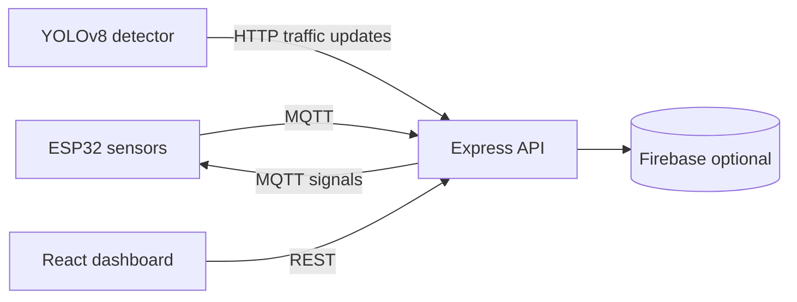

# Architecture

The backend owns intersection state, signal optimization, emergency corridor coordination, and analytics history. MQTT is optional for local development; the application continues with in-memory state when external services are unavailable.